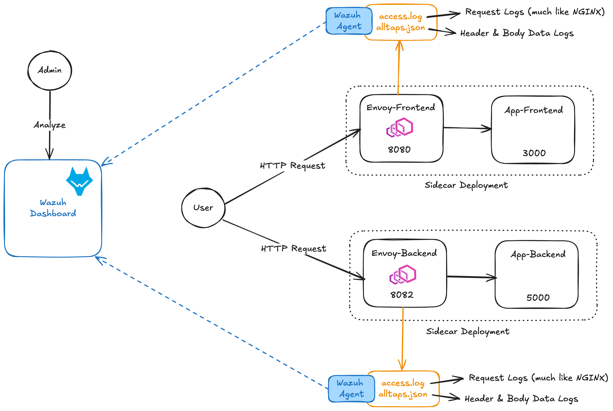

# VEnvoy: Envoy + Wazuh for Visibility Enhancement (VE)

## Overview
VEnvoy is a Dockerized Envoy Proxy with a pre-configured Wazuh Agent, designed to enhance the visibility and observability of a CTF challenge. VEnvoy automatically captures HTTP traffic, including both body and headers, and directly transports this data to Wazuh for examination if any issues arise with the challenge.

## Architecture 

### Basic Principles

VEnvoy operates as a Man-in-the-Middle (MITM) proxy, but not just for HTTP request. VEnvoy currently supports TCP, HTTP, and UDP connections.

Suppose your CTF challenge operates on port `3000`, you can configure Envoy to listen on port `8000`, where the CTF players will access the challenge via port `8000` as well. Envoy will intercept and log all traffic, then redirect them to the `3000` service. Note that you can pick any port for Envoy to listen.

All traffic passing through Envoy is recorded in two files: *access.log* and *alltaps.json*. 
- access.log: XX
- alltaps.json: XX

Those files will automatically be transported to Wazuh and accessible via Wazuh Dashboard.

## Getting Started
### Setup Your Challenge Container

### Sidecar VEnvoy to Challenge Container

### Install Custom Decoder via Wazuh Dashboard

