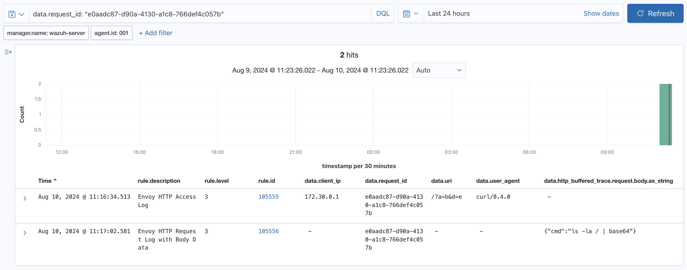

# Wazoy: Envoy + Wazuh for Visibility Enhancement (VE)

## Overview
Wazoy is a Dockerized Envoy Proxy with a pre-configured Wazuh Agent, designed to capture and monitor traffic for any hosted CTF challenges. It automatically collects HTTP/TCP traffic, including both body and headers, and sends this data directly to Wazuh for analysis if any issues are detected.

## The Architecture 

### Basic Principles

Wazuh operates as a Man-in-the-Middle (MITM) proxy, positioned as an entry point to the CTF challenge container. As a **sidecar container**, Wazoy enables HTTP/TCP traffic monitoring without requiring any modifications to the CTF challenge container itself.

<!-- For example, your CTF challenge runs on port `:5000`, and you configure Wazoy to listen on port `:8000`. Envoy will intercept and log all traffic, then redirect them to the `:5000` service. You can choose any port for Wazoy to listen on, not just `:8000`. -->

All traffic passing through Envoy is recorded in two files: *access.log* and *alltaps.json*. 
- access.log: Contains a record of all requests made to the challenge's service.
- alltaps.json: Provides a detailed log of traffic data, including body and header information (available only for HTTP traffic).

Those files will automatically be transported to Wazuh and accessible via Wazuh Dashboard.


## Getting Started
### 1. Setup Your Challenge Container
Well, just do your thing. ¯\\_(ツ)_/¯

### 2. Sidecar Wazoy to Challenge Container

To use Wazoy for your CTF challenge, add Wazoy container configuration to your `docker-compose.yml`.

> [!IMPORTANT]  
> Wazoy follows a sidecar deployment pattern, **hence one CTF challenge service will need one Wazoy container**.

You can obtain a prebuilt version of Wazoy from [siahaan/wazoy-ve](https://hub.docker.com/repository/docker/siahaan/wazoy-ve) on Docker Hub.

```yaml
version: '3'

services:
  app:
    build: ./app
    expose:
      - 5000
  
  # Add this Wazoy container
  wazoy:
    image: siahaan/wazoy-ve
    environment:
      WAZUH_MANAGER_IP: <ip_to_wazuh_server>
      APP_HOST: app
      APP_PORT: 5000
      ENTRY_PORT: 8082 
    ports:
      - 8082:8082 # Envoy listening port
      - 9901:9901 # Envoy admin port
    
```
See the full version of [docker-compose.yml](./dist/docker-compose.yml.example) example here.

To start, there are few basic things to configure:
- `WAZUH_MANAGER_IP`: IP address of your Wazuh server.
- `APP_HOST`: Hostname or service name of your challenge container (e.g., app).
- `APP_PORT`: Port on which the challenge service is running internally (e.g., 5000).
- `ENTRY_PORT`:  Port on which Wazoy listens (e.g., 8082).

> [!TIP]
> Ensure that the `ENTRY_PORT` specified in the environment variables (e.g., `8082`) matches the port mapping in the `docker-compose.yml` file (e.g., `8082:8082`).
>
> Your challenge service will be accessible from `http://<your_server_ip>:ENTRY_PORT` or `tcp://<your_server_ip>:ENTRY_PORT`

### 3. Install Custom Decoder to Wazuh Dashboard

To process Wazoy logs in Wazuh, you need to upload custom decoders and rules into Wazuh Dashboard.

**Access the Wazuh Dashboard**

Open your browser, navigate to the Wazuh Dashboard, and log in.

**Upload Custom Decoders**

- Go to `Settings > Decoders`.
- Click `Upload` or `Add Decoder`.
- Upload all files from the `./wazuh/decoders` directory to Wazuh Dashboard.

**Upload Custom Rules**

- Go to `Settings > Rules`.
- Click `Upload` or `Add Rule`.
- Upload all files from the `./wazuh/rules` directory to Wazuh Dashboard.

**Apply Changes**

Restart the Wazuh manager for changes to take effect.

## Understanding Alerts

All alerts from Wazoy are grouped under the `envoy` alert group in the Wazuh Dashboard.

Wazoy generates two types of alerts:

- Envoy HTTP Access Log (Alert ID 105555)
- Envoy HTTP Request Log with Body Data (Alert ID 105556)

Both alert types share the same Request ID (from the `data.request_id` field), enabling correlation and filtering in the Wazuh Dashboard.

### FAQ: How to inspect body data of a request?

<!--  -->


Identify Request ID (`data.request_id`) of a request recorded in **Envoy HTTP Access Log** (105555) alert. Then, filter every **Envoy HTTP Request Log with Body Data** (105556) alerts that have the same Request ID.

### FAQ: How to detect if certain payload is contained in the traffic?
To check if a specific payload is present in the HTTP request body, use `data.http_buffered_trace.request.body.as_string` in **Envoy HTTP Request Log with Body Data** (105556) alerts.

To check if a specific payload is present in the HTTP response body, use `data.http_buffered_trace.response.body.as_string` in **Envoy HTTP Request Log with Body Data** (105556) alerts.

You can then create [custom Wazuh rules](https://documentation.wazuh.com/current/user-manual/ruleset/rules/custom.html) based on these conditions. 


### FAQ: How to filter request logs based on IP address?

<!--  -->


The IP address is available in the **Envoy HTTP Access Log** (105555) alert, specifically in the `data.client_ip` field.

